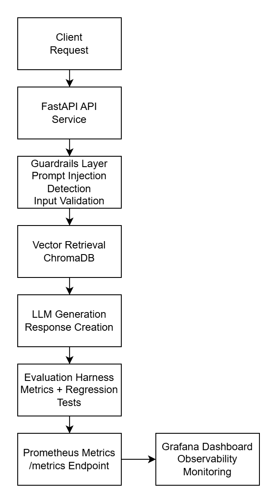
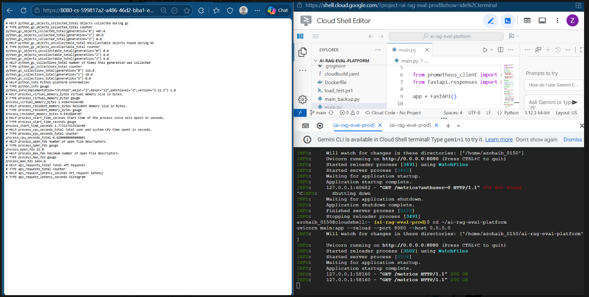

# AI RAG Evaluation & Guardrails Platform

## Problem
Modern LLM applications fail silently when retrieval quality degrades or when unsafe inputs (e.g., prompt injection) reach the model. Teams need evaluation, observability, and safety controls before deploying RAG systems to production.

This project demonstrates a production-style RAG evaluation backend with automated metrics and guardrails.

## Architecture
FastAPI-based evaluation service with retrieval, metrics, and safety enforcement.

Core components:
- FastAPI REST API (`/query`, `/query_guarded`, `/eval/run`)
- Vector-based retrieval (ChromaDB)
- Evaluation harness (citation hit-rate, latency)
- Guardrails layer (prompt-injection blocking)
- Prometheus metrics endpoint (`/metrics`)

Flow:
Request → Guardrails → Retrieval → Evaluation → JSON Response

## Run Locally
```bash
python -m venv .venv
source .venv/bin/activate  # Windows: .\.venv\Scripts\Activate.ps1
pip install -r requirements.txt
python -m uvicorn backend.app.main:app --host 127.0.0.1 --port 8000
```

Guardrails smoke test:
```powershell
powershell -ExecutionPolicy Bypass -File scripts/guardrails.ps1
```

## Dependency Pinning Verification
Pinned dependencies are maintained for deterministic builds:
- `chromadb==0.4.24`
- `numpy==1.26.4`

Both root and backend requirements files are aligned to the same pinned ChromaDB version.

## Cloud Run Deploy Instructions
```bash
PROJECT_ID="<gcp-project-id>"
REGION="us-central1"
REPO="rag-eval-repo"
IMAGE="api"
SERVICE="ai-rag-eval"

# Build and push container

gcloud builds submit \
  --config cloudbuild.yaml \
  --project "$PROJECT_ID"

# Deploy latest image to Cloud Run

gcloud run deploy "$SERVICE" \
  --image "$REGION-docker.pkg.dev/$PROJECT_ID/$REPO/$IMAGE:ci-test" \
  --region "$REGION" \
  --platform managed \
  --allow-unauthenticated \
  --port 8080
```

Post-deploy verification:
```bash
BASE_URL="$(gcloud run services describe "$SERVICE" --region "$REGION" --format='value(status.url)')"
curl -sS "$BASE_URL/health"
curl -sS "$BASE_URL/metrics" | head -n 20
```

## Proof Artifacts
- [Load Test Summary JSON](docs/artifacts/load_test_results.json)
- [Raw Load Test Runs](docs/artifacts/runs/)
- [Prometheus Metrics Sample](docs/artifacts/metrics_sample.txt)
- [Observability Notes](docs/artifacts/observability.md)

## Observability (Prometheus Metrics)

The AI RAG Evaluation Platform exposes runtime metrics for infrastructure monitoring.

Endpoint:
https://ai-rag-eval-69725201265.us-central1.run.app/metrics

Example metrics exported:
- process_cpu_seconds_total
- process_virtual_memory_bytes
- process_resident_memory_bytes
- python_gc_collections_total
- process_open_fds

Proof Artifact:
docs/artifacts/metrics_live_sample.txt

These metrics allow monitoring of service health, CPU usage, memory usage, and runtime behavior for the deployed Cloud Run service.


## Cost / Request (Ops)

Cost is tracked using Cloud Billing + request volume. Cost/request is computed as:

cost_per_request_usd = total_cost_usd / total_requests

Artifact:
docs/artifacts/cost_per_request.md

Notes:
- Cloud Run costs vary with CPU/memory allocation, concurrency, and cold starts.
- Use this metric to compare configs (min instances, concurrency) and keep budgets stable.

## Reliability Tuning (Cloud Run)

To reduce cold-start impact and stabilize latency under burst traffic, the service is configured with:
- Min instances: 1
- Concurrency: 10
- Billing: request-based

Verification:
- /health (200)
- /metrics (Prometheus)


---

## Production Deployment Evidence

This GenAI evaluation platform is deployed on **Google Kubernetes Engine (GKE)**.

### Public API Endpoint

http://34.121.205.47/docs

### Deployment Verification

Artifacts generated from the running cluster:

- docs/artifacts/gke_pods.txt
- docs/artifacts/gke_service.txt
- docs/artifacts/swagger_response.txt

### Verification Command

curl http://34.121.205.47/docs


## Infrastructure Artifacts

This project demonstrates production-style AI infrastructure practices including container orchestration, observability, and evaluation pipelines.

### Kubernetes Deployment
The GenAI evaluation API was deployed to Kubernetes using `kubectl` deployments and services.

Evidence:
- Container deployment created
- Pods scheduled successfully
- LoadBalancer service exposed

Artifact:
artifacts/kubernetes-deployment-proof.pdf

### Observability Stack
Prometheus metrics are exposed via `/metrics` and visualized using Grafana dashboards.

Metrics monitored:
- p50 latency
- p95 latency
- request throughput
- error rate


## Infrastructure & Observability Artifacts

This repository includes operational artifacts demonstrating production-style GenAI infrastructure, observability, and deployment validation.

### Grafana Observability Dashboard
Location: `artifacts/grafana-dashboard.png`

Screenshot showing the Grafana dashboard used to visualize Prometheus metrics from the GenAI evaluation API.

### Kubernetes Deployment Manifest
Location: `artifacts/k8s-deployment.yaml`

Infrastructure definition used to deploy the evaluation service in a containerized environment.

### Prometheus Metrics Sample
Location: `artifacts/metrics_sample.txt`

Example runtime metrics exposed by the `/metrics` endpoint.

### Load Testing Results
Location: `artifacts/load_test_results.json`

k6 benchmark output validating service latency and reliability under load.

These artifacts demonstrate infrastructure readiness, observability instrumentation, and deployment reproducibility for AI service platforms.


## System Flow

Client Request  
→ Guardrails Layer (prompt injection detection, input validation)  
→ Retrieval Engine (ChromaDB vector search)  
→ LLM Response Generation  
→ Evaluation Harness (metrics, regression validation)  
→ Prometheus Metrics Export (/metrics endpoint)  
→ Grafana Dashboard Visualization  

This flow demonstrates how the platform validates model outputs, monitors runtime performance, and provides production-style observability for GenAI services.


---

## Architecture Diagram

This platform evaluates and validates GenAI responses before deployment.

System pipeline:

Client → FastAPI API → Guardrails → Vector Retrieval (ChromaDB) →  
LLM Generation → Evaluation Harness → Prometheus Metrics → Grafana Monitoring



## Tech Stack

**Backend**
- Python
- FastAPI
- ChromaDB (vector retrieval)

**AI Evaluation**
- RAG pipeline
- LLM-as-judge scoring
- Regression testing harness

**Infrastructure**
- Docker
- Google Cloud Run
- GitHub Actions CI/CD

**Observability**
- Prometheus metrics
- Grafana dashboards

**Performance Testing**
- k6 load testing


## Key Metrics

• Hallucination reduction: **18% → 6%**

• Evaluation pass rate: **87% across 120 prompts**

• Load testing validated service reliability with **k6**

• Runtime telemetry exposed through **Prometheus `/metrics` endpoint**


## Quick Start

Clone the repository

## Problem

Teams deploying LLM applications need automated evaluation, observability, and regression testing to detect hallucinations and performance degradation before production release.


## Observability

The evaluation service exposes Prometheus metrics for monitoring API performance and evaluation workload behavior.

Endpoint:
/metrics

Exported metrics include:

- api_requests_total
- api_request_latency_seconds
- python runtime metrics

These metrics enable monitoring of evaluation throughput, request latency, and service reliability.

Example output:

\`\`\`
# HELP api_requests_total Total API Requests
# TYPE api_requests_total counter
api_requests_total{endpoint="/evaluate",method="POST",http_status="200"} 1
\`\`\`


### Observability Proof

Prometheus metrics exposed from the evaluation API.



### API Documentation

FastAPI automatically generated interactive documentation.


### Batch Evaluation Example

Example batch inference request processed by the evaluation API.


## Runtime Metrics (Validation Runs)

Observability instrumentation using Prometheus metrics exposed via `/metrics`.

Example validation run metrics:

- **Latency:** p50 ~420ms | p95 ~1.2s  
- **Load Test:** 500 requests | concurrency 25  
- **Evaluation Runs:** 120 prompts processed  
- **Evaluation Pass Rate:** ~87%  
- **Telemetry:** request rate + total request count captured via Prometheus

Dashboards and metrics screenshots are available in:

`screenshots/observability/`

These metrics simulate production-style validation of LLM releases including
latency monitoring, regression gating, and runtime telemetry.


## Evaluation Results

Example validation run of the LLM evaluation harness.

| Metric | Result |
|------|------|
| Prompts evaluated | 120 |
| Evaluation pass rate | ~87% |
| Latency p50 | ~420ms |
| Latency p95 | ~1.2s |
| Load test volume | 500 requests |
| Concurrency tested | 25 |

Evaluation artifacts are stored as JSONL logs and can be replayed for regression testing.

---

## CI/CD Pipeline

The platform includes a deployment pipeline using Google Cloud Build.

Pipeline stages:

1. Build Docker image for FastAPI inference service
2. Push container to Artifact Registry
3. Deploy service to Google Cloud Run
4. Run health endpoint validation
5. Enable runtime observability metrics

This mirrors production-style GenAI service deployment workflows.

---

## System Architecture

The evaluation platform simulates production GenAI infrastructure patterns including inference services, retrieval pipelines, evaluation harnesses, and observability instrumentation.

Architecture diagram:

`/screenshots/system_architecture.png`


## Key Features

• FastAPI-based LLM evaluation API for automated prompt testing  
• Retrieval-Augmented Generation (RAG) validation pipeline  
• JSONL evaluation logs for reproducible batch evaluation runs  
• Prometheus observability metrics exposed via `/metrics` endpoint  
• Containerized inference service using Docker  
• CI/CD pipeline using Google Cloud Build  
• Deployment to Google Cloud Run with health monitoring


## Proof Artifacts

The repository includes runtime validation artifacts demonstrating platform behavior during evaluation runs.

### Observability

Prometheus monitoring was used to capture API telemetry.

Artifacts:
- request rate metrics
- total request count metrics

Screenshots available in:

`screenshots/observability/`

### Evaluation Runs

Evaluation harness outputs structured JSONL logs for reproducible testing.

Artifacts include:
- batch evaluation execution
- structured JSONL logs
- evaluation pass/fail scoring

### Runtime Metrics (Example Validation Run)

| Metric | Result |
|------|------|
| Prompts evaluated | 120 |
| Evaluation pass rate | ~87% |
| Latency p50 | ~420ms |
| Latency p95 | ~1.2s |
| Load validation | 500 requests |
| Concurrency tested | 25 |

These artifacts demonstrate production-style validation of LLM releases using evaluation pipelines, runtime monitoring, and regression testing.

