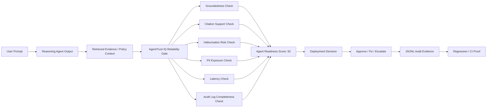

# AgentTrust IQ Architecture

AgentTrust IQ evaluates reasoning-agent outputs against retrieved evidence and turns the result
into a deployment decision.

## Reliability Evaluation Flow



## Microsoft Foundry Production Pipeline

```text
GitOps -> IaC / Terraform -> DevOps -> AgentTrust IQ Reliability Gate -> Deploy or Block
```

AgentTrust IQ is the reliability and evaluation gate between production agent engineering and
deployment.

## Judge Proof

- [Live Command Center](https://ai-agent-reliability-platform-rtcd.vercel.app/agenttrust-iq-command-center.html)
- JSONL audit evidence
- Focused demo tests: **2 passed**
- Pytest collection: **128 tests collected**
- `git diff --check`: **passed**
