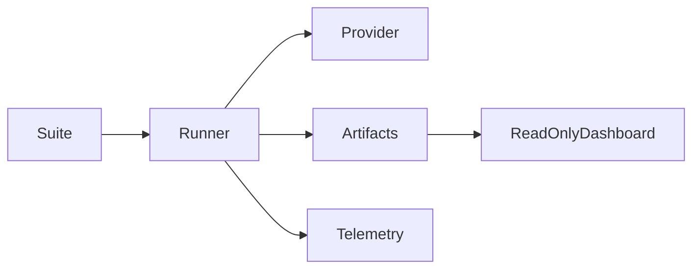

# GPU Benchmark Methodology

Moderate is the default profile: one model, concurrency 1, at most 10 new requests, two retries, 60-second provider timeout, and 1-second telemetry cadence. Authenticated smoke runs should use five requests. Performance is opt-in and requires both `--allow-network` and `--confirm-performance-run`; it has a 50-request hard ceiling, concurrency no greater than 8, up to three warm-ups, and a 500 ms telemetry target.

Latency uses monotonic time. Percentiles exclude warm-ups and cache hits. TTFT is null unless a real streaming timestamp is captured. Token costs are null unless returned usage and user-configured price inputs are both available. Pricing is a configured estimate, never an invoice. A run stops after five consecutive provider failures and authentication/invalid requests are not retried.

